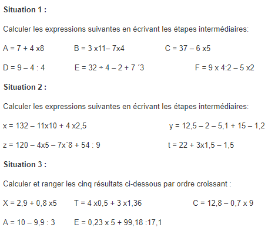
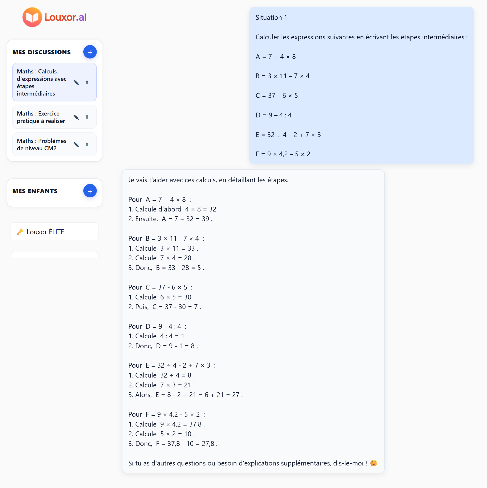

#  TuteurPrivé - Case Study

> Portfolio complet de l'application [TuteurPrivé](https://tuteurprive.com), 
> une plateforme éducative utilisant l'IA pour transformer l'apprentissage scolaire

<div align="center">
  
  
  <br/>
  <em>Page d'accueil de l'application • Interface interactive avec QCM et questions</em>
</div>

---

## 🔗 Liens Utiles

- **Application Live :** [tuteurprive.com](https://tuteurprive.com)
- **Exemples de Leçons Générées :**
  - [La démographie en France](https://tuteurprive.com/shared/97b9edc4-aab8-46f1-9c1f-e9dec2d4ad90/la-demographie-en-france)
  - [L'école sous la IIIe République](https://tuteurprive.com/shared/05c5fa54-7bb3-4396-842c-73f751d315eb/l-ecole-sous-la-iiie-republique)

---

## 👋 Contexte

TuteurPrivé est une application éducative innovante qui utilise l'intelligence artificielle (GPT-4 Vision) pour révolutionner l'apprentissage scolaire. L'application permet aux élèves de :

- **Photographier leurs cours** → extraction automatique du contenu
- **Générer des QCM personnalisés** → basés sur leur leçon exacte
- **Corriger leurs exercices** → analyse intelligente avec feedback détaillé
- **Recevoir une aide guidée** → décomposition pas-à-pas des problèmes difficiles

### 🎯 La différence TuteurPrivé

Contrairement aux IA éducatives généralistes (comme [Louxor.ai](https://louxor.ai/)), TuteurPrivé ne se contente pas d'expliquer des concepts. **L'application transforme les vraies leçons des élèves en contenu pédagogique interactif.**

Ce repo documente mon travail sur ce produit :
- Vision produit et positionnement marché
- Personas utilisateurs
- Architecture fonctionnelle
- Backlog complet priorisé
- Roadmap produit
- Processus de décision PO
- KPIs et mesure d'impact
- Cas pratiques d'arbitrage

---

## 🔍 Contenu du Portfolio

Les documents détaillés se trouvent dans le dossier [`docs/`](./docs).

- **[01 - Vision Produit](./docs/01-vision-produit.md)**
  Problème, solution, proposition de valeur, comparaison avec la concurrence

- **[02 - Personas](./docs/02-personas.md)**
  Élève, parent, professeur (futur mode)

- **[03 - Architecture Fonctionnelle](./docs/03-architecture-fonctionnelle.md)**
  Modules, pipeline IA, flux techniques, choix d'architecture

- **[04 - Backlog Produit](./docs/04-backlog-produit.md)**
  Épics, user stories, critères d'acceptation, priorisation MoSCoW

- **[05 - Roadmap](./docs/05-roadmap.md)**
  Découpage en releases, objectifs par version, stratégie de déploiement

- **[06 - Processus PO](./docs/06-processus-po.md)**
  Approche Scrum, refinements, arbitrages, gestion de la dette technique

- **[07 - KPIs et Mesure d'Impact](./docs/07-kpis-et-mesure-impact.md)**
  Indicateurs suivis, hypothèses, mesure de l'impact pédagogique


---

## 🚀 Innovation Technique

### Pipeline IA Unique

```
[Photo du cours]
    ↓
[OCR + Vision GPT-5]
    ↓
[Extraction des concepts clés]
    ↓
[Génération QCM + Questions + Vocabulaire]
    ↓
[Adaptation au niveau de l'élève]
```

### Stack Technique

- **Frontend:** React 18 + TypeScript + Vite + Tailwind CSS
- **Backend:** Supabase (Auth, Database, Edge Functions, Storage)
- **IA:** OpenAI GPT-5 Vision + Whisper (transcription vocale)
- **State:** Zustand
- **Payments:** Stripe (tokens + abonnements)
- **i18n:** react-i18next (FR/EN)

### Ampleur du Projet

- **15k lignes de code** dans `src/`
  - TypeScript (.ts) : 5k lignes
  - TypeScript React (.tsx) : 10k lignes
  - 200+ fichiers TS/TSX

---

## Exemple Concret : Système d'Aide Guidée

### L'exercice : Priorités Opératoires

TuteurPrivé peut analyser des exercices de mathématiques et générer une aide guidée pas-à-pas sans donner les réponses. Voici un exemple réel d'exercice sur les priorités opératoires avec 3 situations progressives :

<div align="center">
  
  <br/>
  <em>Exercice original : Calculs d'expressions avec étapes intermédiaires</em>
</div>

### Évolution du Système d'Aide Guidée

Le système d'aide guidée de TuteurPrivé a considérablement évolué pour offrir une expérience pédagogique optimale :

#### Version 1 : Guide Méthodologique Simple

<div align="center">
  
  <br/>
  <em>Première version : Guide méthodologique générique en 5 étapes (texte brut)</em>
</div>

La première version proposait une approche structurée en 5 étapes génériques :
1. Identifier les opérations prioritaires (multiplications et divisions)
2. Effectuer les multiplications/divisions une par une
3. Faire les additions/soustractions de gauche à droite
4. Gérer l'alignement des décimales
5. Vérifier l'ordre des opérations et les résultats

**Limite** : Méthodologie trop généraliste, non adaptée aux exercices spécifiques fournis par l'élève.

#### Version 2 : Refonte Complète avec Guidage Contextualisé

<div align="center">
  
  <br/>
  <em>Version améliorée : Guide spécifique aux exercices avec LaTeX et prompt restructuré</em>
</div>

**Améliorations majeures du prompt d'aide guidée :**

1. **Rendu mathématique professionnel avec LaTeX/KaTeX**
   - Expressions inline : `$7 + 4 \times 8$`, `$3 \times 11 - 7 \times 4$`
   - Fractions : `$\frac{3}{4}$`, `$\frac{132 - 11 \times 10}{x}$`
   - Expressions complexes avec indices et exposants
   - Meilleure lisibilité et rendu professionnel

2. **7 Règles obligatoires pour un guidage efficace**
   - Analyser UNIQUEMENT les exercices fournis dans les images
   - Référencer TOUJOURS les exercices par leur nom/numéro (ex: "exercice A", "situation 1")
   - Fournir des exemples CONCRETS tirés des exercices donnés
   - NE JAMAIS donner les réponses finales, mais guider la réflexion
   - Utiliser LaTeX pour toutes les expressions mathématiques
   - Adapter le ton et la complexité au niveau scolaire
   - Être SPÉCIFIQUE et PRÉCIS, jamais généraliste

3. **Étapes guidées contextualisées**
   - Chaque étape fait référence aux exercices spécifiques de l'élève
   - Indices sous forme de questions pour faire réfléchir
   - Exemples tirés directement des données fournies
   - Format JSON structuré avec anti-placeholders

4. **Précision pédagogique accrue**
   - Référence explicite aux numéros d'exercices (A, B, C, etc.)
   - Utilisation des valeurs exactes de l'énoncé ($7 + 4 \times 8$, pas "une addition et une multiplication")
   - Indices orientés vers des éléments concrets (nombre d'opérations, valeurs, etc.)
   - Questions stimulant le raisonnement plutôt qu'affirmations

**Exemple de transformation :**

**Avant** (générique) :
```
Étape 1: "Lis l'expression et repère les opérations à effectuer."
Étape 2: "Effectue les multiplications et divisions une par une."
Étape 3: "Fais les additions et soustractions de gauche à droite."
```

**Après** (spécifique et contextualisé) :
```
Étape 1: "Pour l'exercice A ($7 + 4 \times 8$), commence par identifier
les opérations présentes : une addition et une multiplication."

Étape 2: "Dans l'expression $7 + 4 \times 8$, quelle opération dois-tu
calculer en premier selon la règle de priorité ?"

Étape 3: "Calcule d'abord $4 \times 8$ et écris le résultat intermédiaire.
Puis remplace dans l'expression initiale."

Indice: "Dans l'exercice B ($3 \times 11 - 7 \times 4$), combien y a-t-il
de multiplications à calculer avant de faire la soustraction ?"
```

**Impact :** Passage d'un guide générique réutilisable à un accompagnement personnalisé référençant directement les exercices de l'élève.

#### Comparaison avec Louxor.ai

<div align="center">
  
  <br/>
  <em>Louxor.ai : Résolution complète avec tous les calculs détaillés</em>
</div>

**Différences d'approche pédagogique :**

| Critère | Louxor.ai | TuteurPrivé |
|---------|-----------|-------------|
| **Méthode** | Résout entièrement l'exercice | Guide sans donner la réponse finale |
| **Détails** | Tous les calculs intermédiaires affichés | Questions et indices pour réfléchir |
| **Objectif** | Comprendre la solution | Développer l'autonomie |
| **Rôle** | Professeur qui explique | Tuteur qui accompagne |

**Avantage TuteurPrivé :** L'élève reste actif dans la résolution, développe son raisonnement et apprend à réfléchir plutôt qu'à recopier une solution toute faite.

---

## 🆚 Positionnement Marché vs [Louxor.ai](https://louxor.ai/)

| Critère | Louxor.ai | TuteurPrivé |
|---------|-----------|-------------|
| **Source du contenu** | Questions écrites par l'élève | Photo d'un cours réel (extraction automatique) |
| **Objectif pédagogique** | Expliquer un concept | Faire travailler l'élève sur ses propres leçons |
| **Mode d'entraînement** | Quiz générés à la volée | QCM & exercices basés sur la photo du cahier |
| **Correction d'exercices** | ❌ Non | ✅ Guidage des exercices et aide à la correction par photo |
| **Adaptation au niveau** | ✅ Niveau / âge | ✅ Niveau + contenu spécifique du cours |
| **Type d'IA** | Prof virtuel, réexplication | Assistant d'apprentissage actif |
| **Innovation clé** | IA souveraine française | Pipeline image → leçon → exercices unique |
| **Différenciation** | IA "qui explique" | IA "qui entraîne" |

**Conclusion :** TuteurPrivé occupe une niche plus profonde, plus différenciante, plus pédagogique. L'application ne remplace pas le professeur mais augmente l'efficacité de l'apprentissage autonome.

---

## 📊 Résultats & Impact

### Métriques Actuelles (V1)
- **Tokens gratuits** pour tester le produit
- **1 token = 1 analyse** (leçon/correction/aide guidée)
- **Multi-profils** : plusieurs élèves par compte (fratries)
- **Partage public** : leçons partageables via lien

### Validation Utilisateur
- **Beta tester principal :** Nièce de l'auteur (utilisatrice quotidienne)
- **Feedback :** "Très contente" - utilisation régulière et naturelle
- **Taux d'adoption :** Passage d'un usage ponctuel à un usage systématique
